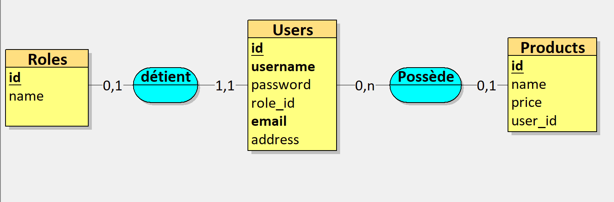

# Groupe de boukri_n 994538

Etape 1 
Ne pas oublier de mettre la description dans la table product
Les champs sont tous en minuscule 
Ne pas hésiter à poser des question à l'intervenant pour vérifier nos tables et nos diagrammes 
Possible d'ajouter des champs dans nos table tant que ça reste logique 
Possible d'ajouter une table role 

Etape 2 
Attention il manque les {id} dans certaines routes (modif, recuperer les info, delete user)
API/ 
- UML de la base de données (.pdf)

# Trucs à changer 
- Ajouter le middleware admin (/users, /me)
- Modifier le MCD !!

# I. Init project

## 1. MySQL installation
>sudo apt install mysql-server

>sudo etc/init.d/mysql start

>mysql -u root -p

## 2. Initialisation of Database
>mysql> source services/product.sql

## 3. Installation des dépendances
> npm install
___ 

# Launch the server
```BASH
npm run start # npm run dev : For developer mode
```
___
# II. Database



